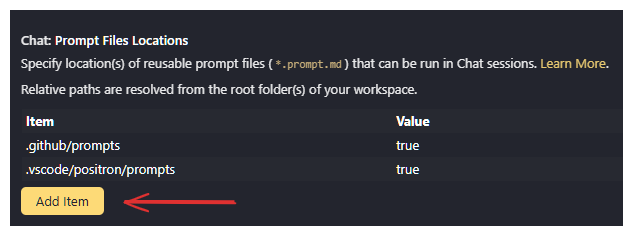

---
abstract: "This document outlines mandatory protocols for using GitHub Copilot in technical work, explains how to use the GPID prompt files that implement these protocols, and provides guidance on installation, usage, and maintenance."
execute:
  eval: true
bibliography: AI.bib
---

# Mandatory Protocols for Using GitHub Copilot in Technical Work {#sec-copilot-protocols}

## Purpose and Principles 

```{r}
#| echo: false
#| results: false
source("R/helpers.R")

```


GitHub Copilot is a powerful assistant that can increase productivity, generate boilerplate code quickly, and support experimentation. However, Copilot is not a substitute for engineering judgment, critical thinking, or expertise in R/Stata. Without discipline, Copilot can also introduce inefficiency, unnecessary complexity, hallucinated dependencies, and silent errors.
This document establishes:

1. **Mandatory protocols** for how Copilot must be used in all GPID technical work.  
2. **A unified system of Copilot prompt files**, named `gpid-proto-*`, which encode these protocols into reproducible steps.  
3. **Clear instructions** on how to install, update, and use these prompt files across all GPID projects.

Team leads will verify compliance during code reviews.


## GPID Copilot Prompt System

To ensure consistency, the GPID team uses **shared Github Copilot prompt files** stored in a central repository. These prompt files automate the workflows described in this document.

### What Are GPID Prompt Files?

Prompt files are `.prompt.md` files that define reusable Github Copilot commands.  
They appear in VS Code or Positron when you type `/` in Github Copilot Chat.

Each GPID protocol prompt begins with the prefix `gpid-proto-`

Examples:

- `/gpid-proto-start-task` ← **always first** (plan + initialize)
- `/gpid-proto-log-update`
- `/gpid-proto-explain-code`
- `/gpid-proto-document-code`
- `/gpid-proto-review-code`
- `/gpid-proto-tests-checklist`
- `/gpid-proto-deps-risk`
- `/gpid-proto-wrap-task`

These commands help you follow the mandatory protocols with minimal effort.


### Where the Prompt Files Live

The shared prompts are stored in the repository [GPID-WB/copilot-prompts](https://github.com/GPID-WB/copilot-prompts).  The prompt files for these protocols are in the folder prompts/

```
protocols/
gpid-proto-start-task.prompt.md
gpid-proto-log-update.prompt.md
gpid-proto-explain-code.prompt.md
gpid-proto-document-code.prompt.md
gpid-proto-review-code.prompt.md
gpid-proto-tests-checklist.prompt.md
gpid-proto-deps-risk.prompt.md
gpid-proto-wrap-task.prompt.md

.github/agents/
gpid-planner.agent.md

```

These prompts are **global tools** used in *every* GPID technical project.


### One-Time Installation (Per Developer)

Each team member must clone the prompts repository locally. For the rest of this document, we assume you clone it to:

`C:\Users\<USERNAME>\OneDrive - WBG\GPID-team\copilot-prompts`

### Registering Prompt Files and the GPID Planner Agent in VS Code / Positron

After cloning, you must register two paths in your **user settings**.

#### 1. Register the prompt files

1. In VS Code/Positron, open settings via the gear icon in the lower left corner or by hitting `Ctrl + ,`.
2. Search for `chat.promptFilesLocations` (without quotes).
3. Hit "add item" and add the full path to the `protocols/` subfolder.

4. Typing `/` in Github Copilot Chat will now show all GPID protocol prompts.

#### 2. Register the GPID Planner agent

1. In the same settings, search for `chat.agentFilesLocations`.
2. Hit "add item" and add the full path to the `.github/agents/` subfolder of your local clone above:
3. Restart VS Code/Positron.

NOW: The **GPID Planner** agent will appear in the agents dropdown in Github Copilot Chat.

Whenever a prompt file changes, you will be notified. However, the best practice is to regularly update your local copy. You can do it by opening the `copilot-prompts` folder in a terminal and running `git pull`, opening the whole folder in Positron and VScode and sync the changes or by using script similar to this:

```bash
cd "C:\Users\USERNAME\OneDrive - WBG\GPID-team\copilot-prompts"
git pull
```


## How the GPID Copilot Workflow Works

### The big picture

Every GPID task follows this workflow:

```{mermaid}
flowchart LR
  A["/gpid-proto-start-task\n(plan + initialize)"] --> B["Implementation\nloop"]
  B --> C["/gpid-proto-log-update\n(after each milestone)"]
  C --> B
  B --> D["/gpid-proto-wrap-task\n(end of task)"]
```

### What is "plan mode"?

::: {.callout-important}

**Plan mode** in the GPID system means selecting the **GPID Planner** custom agent from the agents dropdown in Github Copilot Chat — it is not a slash command.

The GPID Planner agent is read-only (no file edits allowed) and its only job is to produce a deterministic, approved plan before any code is written. Once planning is complete, use the **"Start Implementation"** handoff button to switch to the standard implementation agent.
:::

Step-by-step:

1. Run `/gpid-proto-start-task` — this automatically switches to the **GPID Planner** agent (as defined in the prompt's `agent:` field), gathers task info, produces the plan, handles the TTL approval reminder if needed, and saves the log. Optionally, you can manually select **GPID Planner** from the agent picker dropdown before running the prompt; the result is the same.
2. Click **Start Implementation** when the plan is approved — this switches you to `Agent` mode with the approved plan already in context.
3. Work through the implementation using the prompts described below.
4. Run `/gpid-proto-log-update` after each meaningful milestone.
5. Run `/gpid-proto-wrap-task` to close the task and produce the final validation bundle.

### Model assignment

Some prompts are assigned a lightweight model to save cost on documentation-only tasks. Tasks requiring complex reasoning use the model you have selected in the chat picker.

| Prompt | Model | Reason |
|---|---|---|
| `/gpid-proto-start-task` | User's selected model | Requires reasoning to produce a deterministic plan |
| `/gpid-proto-explain-code` | Claude Haiku 4.5 → Claude Sonnet 4.5 | Linear summarisation; lightweight |
| `/gpid-proto-document-code` | Claude Haiku 4.5 → Claude Sonnet 4.5 | Mechanical comment/Roxygen2 generation |
| `/gpid-proto-log-update` | Claude Haiku 4.5 → Claude Sonnet 4.5 | Structured append; no reasoning required |
| `/gpid-proto-review-code` | User's selected model | Adversarial reasoning about code quality |
| `/gpid-proto-tests-checklist` | User's selected model | Requires reasoning about correctness and edge cases |
| `/gpid-proto-deps-risk` | User's selected model | Security and compatibility reasoning |
| `/gpid-proto-wrap-task` | User's selected model | Synthesises entire session; most demanding |

> **To update the lightweight model:** search for `Claude Haiku 4.5` in the `protocols/` folder and replace both the primary and fallback entries in the three affected prompt files.

---

## The GPID Protocol Prompts

The following sections describe each mandatory protocol and the corresponding `gpid-proto-*` prompt.

### Protocol   — Planning and Initializing the Task {.unnumbered}

**Prompt:**

```
/gpid-proto-start-task
```

::: {.callout-important}
This is **Protocol 1 — mandatory for every task**. Run this inside the **GPID Planner** agent (see workflow above). No implementation should begin without a saved plan.
:::

#### Purpose {.unnumbered}

Before any implementation begins, the team must produce a detailed, deterministic plan. This ensures that:

- The scope and approach are agreed upon before code is written.
- Tasks assigned by a TTL are reviewed for approval before proceeding.
- Any deviation from the plan during implementation is **explicitly flagged and documented** with a rationale.

#### What It Does {.unnumbered}

When you run `/gpid-proto-start-task` (inside the GPID Planner agent), Github Copilot:

1. Asks for **task name**, **description**, and **whether the task is TTL-assigned**.
2. Produces a **numbered checklist plan** (`- [ ] Step N: ...`) covering scoping, design, implementation, validation, documentation, and wrap-up.
3. If TTL-assigned, displays a soft approval reminder before proceeding.
4. Saves the plan to `copilot_logs/LOG_${TASK_NAME}.md` under `## PLAN`, with an empty `## Plan Deviations` block.
5. Creates `.current_task` and begins a **running session summary**.

#### Plan Deviations {.unnumbered}

If the plan changes during implementation, the deviation must be logged with the strict marker:

```
### ⚠️ PLAN DEVIATION — YYYY-MM-DD HH:MM:SS
```

Every deviation is also appended to the `## Plan Deviations` block at the top of the log. This block is greppable: `git grep "PLAN DEVIATION" copilot_logs/` surfaces all deviations across all tasks.

#### Latest GPID prompt file {.unnumbered}

::: {.callout-note collapse="true" title="gpid-proto-start-task"}

```{r}
#| echo: false
#| results: asis
#| code-fold: true
embed_gpid_prompt("gpid-proto-start-task.prompt.md")

```

:::


### Protocol   — Logging progress of the task {.unnumbered}

**Prompt:**

```
/gpid-proto-log-update
```

#### Purpose {.unnumbered}

Keep the `copilot_logs/LOG_${TASK_NAME}.md` updated with regular progress updates.


#### What It Does {.unnumbered}

When you run `/gpid-proto-log-update`, Github Copilot will append an update to the running summary in `copilot_logs/LOG_${TASK_NAME}.md` with:

- **Timestamp**: Include the current date and time in ISO format (YYYY-MM-DD HH:MM:SS)
- **Progress summary**: Key accomplishments since the last update
- **Challenges encountered**: Any blockers, issues, or difficulties faced
- **Changes to plan**: Deviations from the original approach or scope
- **Next steps**: What will be tackled next  


#### Latest GPID prompt file {.unnumbered}

::: {.callout-note collapse="true" title="gpid-proto-log-update"}

```{r}
#| echo: false
#| results: asis
#| code-fold: true
embed_gpid_prompt("gpid-proto-log-update.prompt.md")

```

:::


### Protocol   — Making the Code Understandable {.unnumbered}

**Prompts:**

```
/gpid-proto-explain-code
/gpid-proto-document-code
```

#### Purpose {.unnumbered}

Github Copilot may generate correct code, but not always readable code.
These prompts ensure that the logic, intention, and structure are thoroughly documented.

#### What They Do  {.unnumbered}

##### `/gpid-proto-explain-code` {.unnumbered}

* Asks what function/file you want explained
* Produces a **step-by-step technical explanation**
* Lists assumptions
* Identifies failure points

##### Latest GPID prompt file {.unnumbered}

::: {.callout-note collapse="true" title="gpid-proto-explain-code"}

```{r}
#| echo: false
#| results: asis
#| code-fold: true
embed_gpid_prompt("gpid-proto-explain-code.prompt.md")

```

:::


##### `/gpid-proto-document-code` {.unnumbered}

* Adds in-code comments (the “what” and the “why”)
* Adds full Roxygen2 documentation (for R code)
* Produces a plain-language explanation for the task summary

##### Latest GPID prompt file {.unnumbered}

::: {.callout-note collapse="true" title="gpid-proto-document-code"}

```{r}
#| echo: false
#| results: asis
#| code-fold: true
embed_gpid_prompt("gpid-proto-document-code.prompt.md")

```

:::


### Protocol   — Code Review {.unnumbered}

**Prompt:**

```
/gpid-proto-review-code
```

#### Purpose {.unnumbered}

Before testing, every piece of Copilot-generated code must undergo a combined efficiency, complexity, and robustness review.

#### What It Does {.unnumbered}

The prompt reviews code for:

* inefficiencies and unnecessary copies
* complexity and dead code
* risky assumptions and poor NA handling
* dependency bloat and stack alignment (`data.table`, `collapse`, `rlang`)

It ends with a **Key strengths / Key risks / Top 3 improvements** summary.

#### Latest GPID prompt file {.unnumbered}

::: {.callout-note collapse="true" title="gpid-proto-review-code"}

```{r}
#| echo: false
#| results: asis
#| code-fold: true
embed_gpid_prompt("gpid-proto-review-code.prompt.md")

```

:::

### Protocol   — Testing and Edge Cases {.unnumbered}

**Prompt:**

```
/gpid-proto-tests-checklist
```

#### Purpose {.unnumbered}

No Copilot-generated code is accepted without thorough testing.

#### What It does {.unnumbered}

1. A **validation checklist**
2. `testthat` unit tests (for R)
3. Stata assertions (if needed)
4. Optional performance tests

All structured for direct inclusion in your PR.

#### Latest GPID prompt file {.unnumbered}

::: {.callout-note collapse="true" title="gpid-proto-tests-checklist"}

```{r}
#| echo: false
#| results: asis
#| code-fold: true
embed_gpid_prompt("gpid-proto-tests-checklist.prompt.md")

```

:::


### Protocol   — Dependencies, Risks, and Safety {.unnumbered}

**Prompt:**

```
/gpid-proto-deps-risk
```

#### Purpose {.unnumbered}

Ensure that dependencies are justified, safe, and aligned with team standards.

#### What It Does {.unnumbered}

* Lists all dependencies
* Explains why each is needed
* Flags unnecessary packages
* Checks compatibility with `data.table`, `collapse`, and `rlang`
* Identifies unsafe patterns (I/O, file paths, etc.)

#### Latest GPID prompt file {.unnumbered}

::: {.callout-note collapse="true" title="gpid-proto-deps-risk"}

```{r}
#| echo: false
#| results: asis
#| code-fold: true
embed_gpid_prompt("gpid-proto-deps-risk.prompt.md")

```

:::


### Protocol   — Producing the Final Validation Bundle {.unnumbered}

**Prompt:**

```
/gpid-proto-wrap-task
```

#### Purpose {.unnumbered}

Every Copilot-assisted task ends with a **final Markdown summary** stored under:

```
copilot_logs/TASK_NAME.md
```

#### What It Does {.unnumbered}

* Task overview
* Step-by-step technical explanation
* Plain-language overview
* In-code comments summary
* Roxygen2 documentation summary
* Validation checklist
* Unit tests and edge cases
* Error-handling strategy
* Dependency and risk analysis
* Code review findings
* Remaining TODOs

This file must **always** be included in your PR.

#### Latest GPID prompt file {.unnumbered}

::: {.callout-note collapse="true" title="gpid-proto-wrap-task"}

```{r}
#| echo: false
#| results: asis
#| code-fold: true
embed_gpid_prompt("gpid-proto-wrap-task.prompt.md")

```

:::


::: {.callout-important}
If you're working in an R package, make sure to include the `copilot_logs` folder in your `.Rbuildignore` file to prevent it from being included in the package build. 

You can do it by

1. executing `usethis::use_build_ignore("copilot_logs")` or, 
2. by manually adding the line `^copilot_logs/$` to the `.Rbuildignore` file.
:::

## Final Reminder: You Are the Author


**The code produced by Github Copilot is ultimately your responsibility.**

• **Authorship means accountability**: When you commit Copilot-assisted code, you are claiming authorship of it. This means you're responsible for its correctness, efficiency, and maintainability.

• **Review is mandatory**: Skipping the efficiency review puts the burden on your teammates during code review, slows down development, and can introduce bugs or performance issues that are hard to trace later.

• **Use Github Copilot as a tool, not a replacement**: Github Copilot accelerates your work, but it cannot replace your engineering judgment. You must understand, evaluate, and refine everything it produces.

**Bottom line:** If you wouldn't put your name on it as-is, don't commit it yet. Clean it up first.


## Full Workflow Example

The diagram below shows a complete task walkthrough where all prompts are used. This is the recommended sequence when working on a non-trivial feature or bug fix.

```{mermaid}
flowchart TD
    A(["/gpid-proto-start-task\nPlan & initialize\n(GPID Planner agent)"]) --> B["Implement\ncode changes"]
    B --> C["/gpid-proto-explain-code\nDocument understanding\nof new/changed code"]
    C --> D["/gpid-proto-document-code\nGenerate comments\n& Roxygen2 docs"]
    D --> E["/gpid-proto-tests-checklist\nDefine & run\ntest cases"]
    E --> F["/gpid-proto-deps-risk\nAssess dependency\n& security risks"]
    F --> G["/gpid-proto-review-code\nAdversarial code\nquality review"]
    G --> H{More work\nneeded?}
    H -- Yes --> B
    H -- No --> I["/gpid-proto-log-update\nLog milestone"]
    I --> J{Task\ncomplete?}
    J -- No --> B
    J -- Yes --> K(["/gpid-proto-wrap-task\nFinal validation bundle\n& close task"])

    style A fill:#d4edda,stroke:#28a745
    style K fill:#d4edda,stroke:#28a745
    style H fill:#fff3cd,stroke:#ffc107
    style J fill:#fff3cd,stroke:#ffc107
```

> **Note:** `/gpid-proto-log-update` should be run after each meaningful milestone, not only at the end. The loop above is simplified; in practice, you may log several updates before the task is complete.

