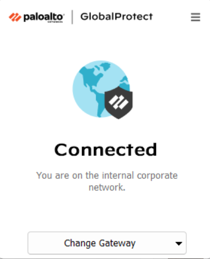
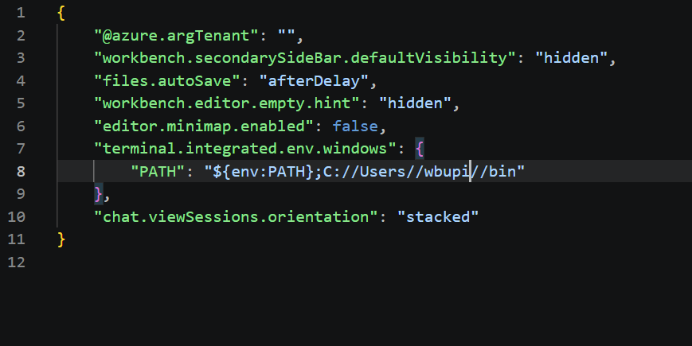

## Overview

Setting up Desktop Access to mAI Factory involves three stages:

1. **Prerequisites** (this chapter) — install the required tools on your machine
2. [**On-Boarding Request**](mAI_factory_setup_access_request.qmd) — request access to the ITSAI platform
3. [**Environment Setup and Configuration**](mAI_factory_environment_setup.qmd) — configure credentials and verify your first API call

If you plan to call mAI Factory from an **R/Shiny app deployed on Posit Connect** (rather than from a local Python script), see the separate [R/Shiny integration guide](mAI_integration.qmd) instead.

## Understand the Two Credentials

There are two separate credentials involved in this setup. It is important not to confuse them:

1. **Artifactory identity token** (username + reference token generated in JFrog) — used **only** to authenticate to the World Bank's internal package repository so you can download the `itsai-platform` SDK. It is *not* used to call the AI models.
2. **mAI Factory access token** — this is what actually authenticates your calls to the AI models. For Desktop Access, there is no static key to generate; it comes from an interactive browser login handled by the SDK itself (covered in [Environment Setup](mAI_factory_environment_setup.qmd)).

## Prerequisites

Before starting the setup steps in this guide, make sure the following are in place.

### Python 3.12

Install Python, or update your existing installation, to a version up to and including **3.12**. You can download the latest compatible installer from the [official Python website](https://www.python.org/downloads/) and verify your version with:

::: {.panel-tabset}

#### Windows

```powershell
python --version
```

#### macOS

```bash
python3 --version
```

:::

### Connected to the World Bank GlobalProtect VPN

You must be connected to the World Bank **GlobalProtect VPN**, on the **US East** gateway.

- If you are in the DC office and connected to the **bluemarlin** WiFi network, you do not need to worry about which region the gateway is on — as long as the GlobalProtect client shows the connection status as **"Connected"**, you're good to go.
- If you are outside the DC office (or not on bluemarlin), connect to GlobalProtect and select the **US East** gateway explicitly.



### Install `uv`

`uv` is used to manage the Python environment and dependencies for this project.

::: {.panel-tabset}

#### Windows

1. Visit the [UV releases page](https://github.com/astral-sh/uv/releases).
2. Download the latest `uv-x86_64-pc-windows-msvc.zip` file.
3. Create a `bin` folder in your home directory:

   ```
   C:\Users\<wbupi>\bin
   ```

4. Extract the contents of the zip file and move them into the `bin` folder you just created.

5. Configure VS Code so its integrated terminal can find `uv` on `PATH`. Open the VS Code settings (JSON) file — `Ctrl+Shift+P` → **Preferences: Open User Settings (JSON)** — and add the following:

   ```json
   {
     "terminal.integrated.env.windows": {
       "PATH": "${env:PATH};C://Users//wbupi//bin"
     }
   }
   ```

  

   Replace `wbupi` with your own Windows username, then restart any open terminals in VS Code for the change to take effect.

#### macOS

The recommended way to install `uv` on macOS is via Homebrew:

```bash
brew install uv
```

If Homebrew itself is not installed, install it first from <https://brew.sh>, then run the command above.

**Alternative — standalone installer** (if you prefer not to use Homebrew):

```bash
curl -LsSf https://astral.sh/uv/install.sh | sh
```

Verify the installation by opening a **new** terminal window and running:

```bash
uv --version
```

You should see a version number returned.

:::

## Next Steps

Once the prerequisites above are in place:

1. Submit your [ITSAI Platform On-Boarding Request](mAI_factory_setup_access_request.qmd) if you have not already done so.
2. After approval, continue with [Environment Setup and Configuration](mAI_factory_environment_setup.qmd) to configure credentials, install the SDK, and verify your first API call.
