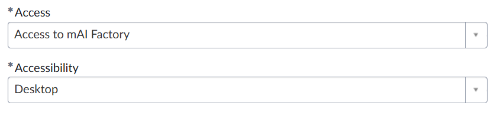

# ITSAI Platform On-Boarding Request

Before you can call any model through mAI Factory, you first need access to the **ITSAI platform**. This is the identity and access layer that issues the credentials — an API token and a base URL — required to authenticate every request the pipeline makes. Without completing this step, none of the later configuration (environment variables, client setup, test calls) will work, so treat this as the mandatory starting point.

> **Already have access?** Skip ahead to [Environment Setup and Configuration](mAI_factory_environment_setup.qmd).

## Why this step matters

- The ITSAI platform manages who is allowed to consume internal AI models.
- Access is granted per-user, so each team member running this pipeline needs their own on-boarding request.
- The token you receive is tied to your account and should be treated like a password — never commit it to source control or share it over chat/email.

## How to request access

**If you are a World Bank staff member:**

1. Open the onboarding request form: [mAI Factory Onboarding Request](https://worldbankgroup.service-now.com/wbg/en/itsai-platform-on-boarding-request?id=wbg_sc_catalog&sys_id=7715cc6d93ac96d0a2f6fd647aba1042).
2. On the form, go to the **Access** field and select **Access to mAI Factory** from the drop-down.
3. Under **Accessibility**, select **Desktop** from the drop-down.

4. Fill in the **Purpose** field based on the project you're working on (e.g., "Access needed to integrate internal LLMs into the `survey-scribe` extraction pipeline").
5. Submit the request and wait for approval. Processing is handled through the standard ServiceNow ticket workflow, so approval time can vary.
6. Once approved, move on to [Environment Setup and Configuration](mAI_factory_environment_setup.qmd).

**If you are an IFC user:**

Do **not** use the standard ServiceNow form above — it is not configured for IFC accounts. Instead, email [itsai_platform_admin@worldbankgroup.org](mailto:itsai_platform_admin@worldbankgroup.org) directly to request the IFC-specific onboarding form.

## What to do while you wait

Approval isn't instant, so while your request is pending you can:

- Read ahead to [Environment Setup and Configuration](mAI_factory_environment_setup.qmd) to understand what you'll do with the token once it arrives.
- Confirm you have a working Python environment set up (see the [Prerequisites](mAI_factory_API_setup_prerequisities.qmd)) so you're ready to configure credentials as soon as access is granted.

> **Tip:** Keep the ticket number from your request handy — you may need it if you have to follow up on a delayed approval.

## Related chapters

| Topic | Chapter |
|---|---|
| Install Python and `uv` | [Prerequisites](mAI_factory_API_setup_prerequisities.qmd) |
| Configure credentials and test your first call | [Environment Setup and Configuration](mAI_factory_environment_setup.qmd) |
| R/Shiny integration via Posit Connect (no ITSAI on-boarding needed) | [R/Shiny Integration](mAI_integration.qmd) |
